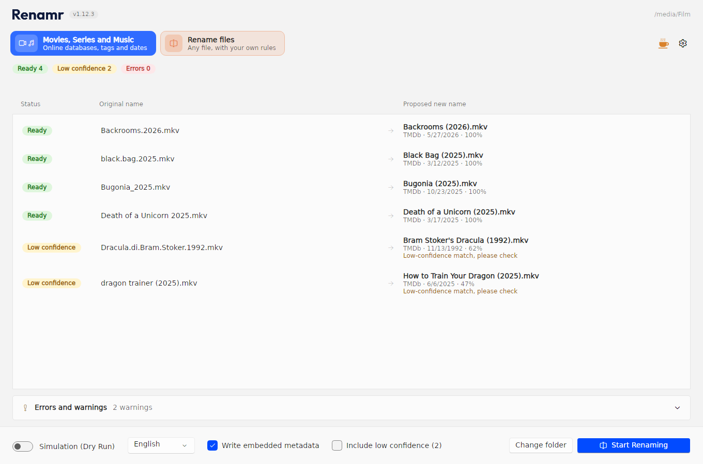
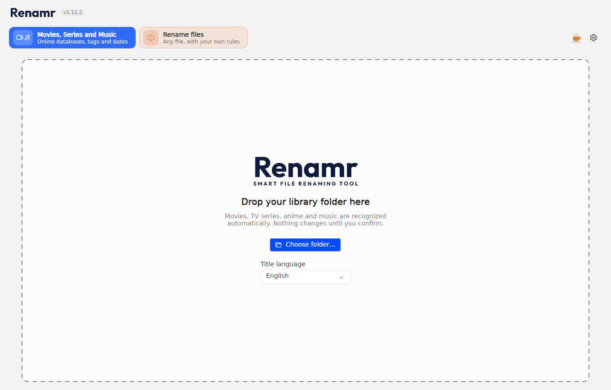
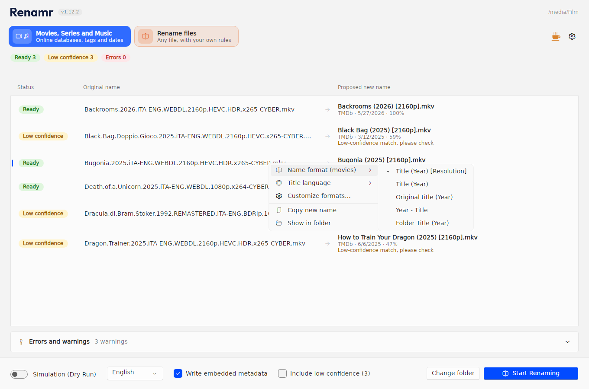
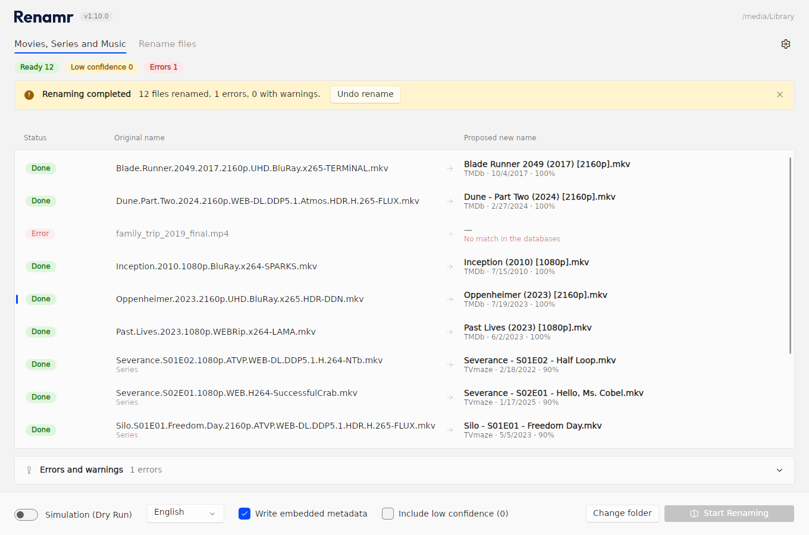
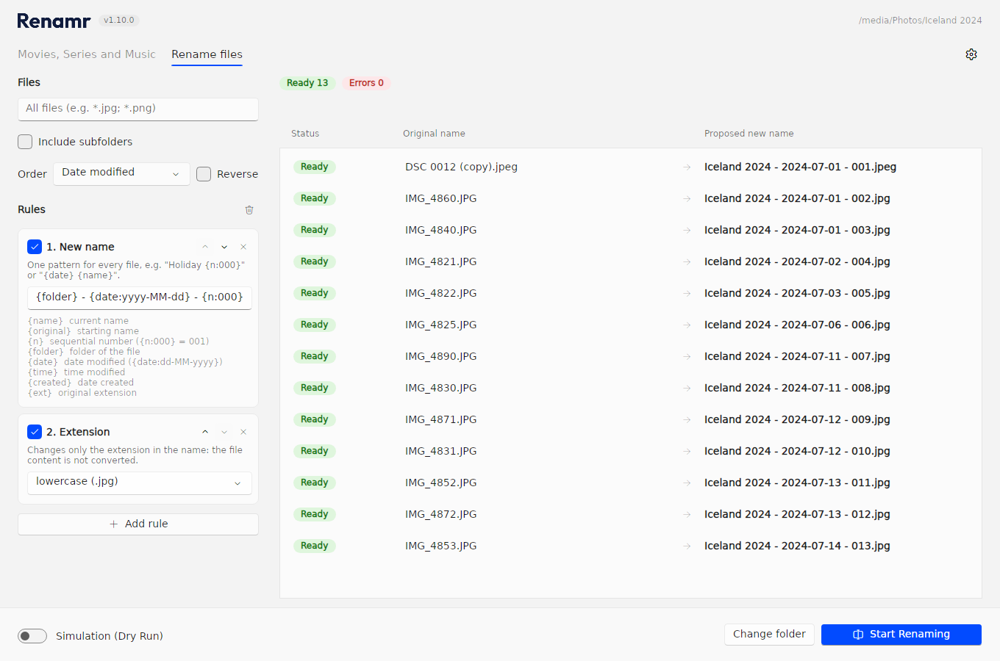
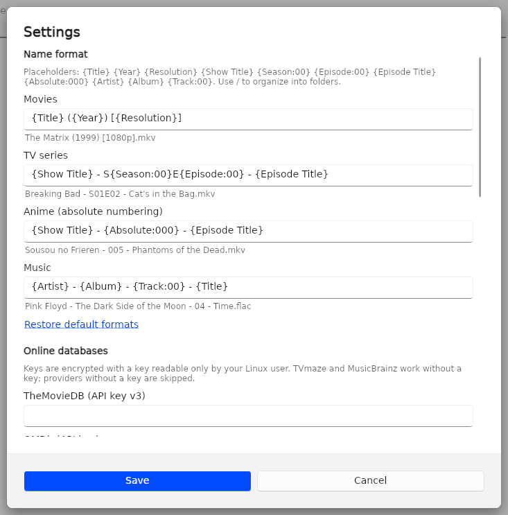
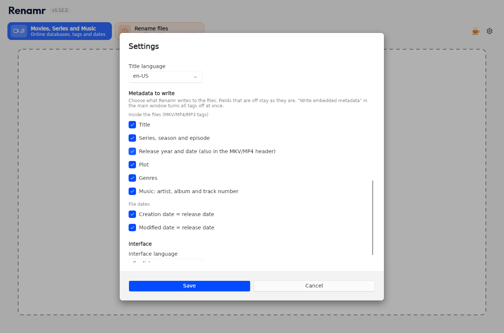

<p align="center">
  
</p>

<p align="center">
  <b>Recognise, rename and date your movies, TV series, anime and music — or batch-rename any group of files.</b><br>
  Windows 10/11 and Linux · .NET 10 · six interface languages
</p>

<p align="center">
  <a href="https://github.com/Ares-87/Renamr/releases/latest"><b>Download the latest release</b></a> ·
  <a href="#features">Features</a> ·
  <a href="#getting-started">Getting started</a> ·
  <a href="#building-from-source">Build from source</a>
</p>



Renamr takes a folder full of names like `Oppenheimer.2023.2160p.UHD.BluRay.x265.HDR-DDN.mkv`, looks every file up in the
online movie, TV and music databases, and turns it into `Oppenheimer (2023) [2160p].mkv`. It also writes the real release
date into the file system and into the file's own tags, so your library sorts by the date the film came out, not the
date you downloaded it. Nothing on disk changes until you press **Start Renaming**, and every rename can be undone.

For everything that isn't a movie or a song, the **Rename files** mode renames any group of files with a stack of simple
rules (numbering, patterns with dates and folder names, find and replace, case, clean-up…) and a live preview.

## Contents

- [Features](#features)
- [Screenshots](#screenshots)
- [Download and install](#download-and-install)
- [Getting started](#getting-started)
- [Data sources and API keys](#data-sources-and-api-keys)
- [Name formats](#name-formats)
- [Rename files mode](#rename-files-mode)
- [What Renamr writes to your files](#what-renamr-writes-to-your-files)
- [Safety](#safety)
- [Building from source](#building-from-source)
- [Publishing a release](#publishing-a-release)
- [Project layout](#project-layout)

## Features

**Movies, series and music**

- **Automatic recognition** of movies, TV episodes (`S01E02`, `1x02`), anime with absolute numbering and music, from
  messy scene names: resolution, codecs, HDR, release groups, language tags and other noise are stripped before searching.
- **Seven online databases with automatic fallback**: TMDb, OMDb, TheTVDB, TVmaze, AniDB, AcoustID and MusicBrainz. If one
  source finds nothing or is unreachable the next one is tried, and the preview tells you when a database rejected your key.
- **Titles in your language**: choose the title language (for example `it-IT`, `de-DE`, `en-US`) and every source returns
  localized titles where it has them. An episode title already in your file name is kept when the database only knows the
  English one.
- **Confidence score** for every match. Matches below the threshold (80% by default) are flagged *Low confidence* and
  skipped unless you tick **Include low confidence**.
- **Configurable name formats** with placeholders and folders (`{Show Title}/Season {Season:00}/…`), plus one-click presets
  from the right-click menu of the list.
- **Real release dates on disk**: creation and modification dates set to the release date, and the date also written inside
  MKV, MP4, MP3, FLAC and other containers.
- **You choose which metadata is written**: title, series/season/episode, release date, plot, genres, music artist/album/track,
  creation date and modification date each have their own switch.
- **Subtitles and `.nfo` files follow** the video they belong to.

**Rename files (any file)**

- An ordered list of rules with a **live preview** that updates as you type.
- Numbering, new name from a pattern (`{folder} - {date:yyyy-MM-dd} - {n:000}`), find and replace (with regular
  expressions), add text, remove characters, upper/lower case, clean name and extension rules.
- File filter, optional subfolders and natural sort by name, date, size or extension.
- Chains and swaps (`1 → 2`, `2 → 3`, `A ↔ B`) are handled for you.

**Everywhere**

- **Dry run** checks permissions, locked files and name conflicts without touching anything.
- **Undo** puts every name back, even after a crash.
- Errors stay on their own row: one locked file never stops the rest of the queue.
- Interface in **English, Italian, Spanish, French, German and Portuguese**, following your system language by default.
- Light and dark theme.

## Screenshots

The screenshots come from the Linux build with the interface in English. The Windows app (WinUI 3) has the same layout,
texts and flow.

| | |
|---|---|
|  |  |
| **Start screen.** Drop a folder or pick one; choose the title language. | **Right-click menu.** Switch the name format or the title language for the whole list in one click. |
|  |  |
| **After renaming.** Every row shows its result, and **Undo rename** restores the original names. | **Rename files.** Rules on the left, live preview on the right. |
|  |  |
| **Settings: name formats** with a live example under each one, and the API keys. | **Settings: metadata to write.** Pick exactly which fields end up in your files. |

## Download and install

Download Renamr from the [latest release](https://github.com/Ares-87/Renamr/releases/latest). There is no installer and
no .NET runtime to install.

**One file, double click.** The simplest choice: a single file that starts Renamr directly.

| System | File |
|---|---|
| Windows 10 (1809 or later) / Windows 11, Intel or AMD | `Renamr-<version>-win-x64.exe` |
| Windows 11 on ARM | `Renamr-<version>-win-arm64.exe` |
| Linux x64 | `Renamr-<version>-linux-x64.AppImage` |
| Linux ARM64 | `Renamr-<version>-linux-arm64.AppImage` |

- **Windows**: double-click the `.exe`. The builds are not code-signed, so the first time Windows SmartScreen may ask you
  to confirm (**More info → Run anyway**). The first start unpacks the app into a temporary folder and takes a few seconds
  longer.
- **Linux**: allow the AppImage to run once (file properties → *Allow executing file as program*, or
  `chmod +x Renamr-*.AppImage`), then double-click it. From a terminal you can pass a folder to open:
  `./Renamr-<version>-linux-x64.AppImage /path/to/library`.

**Folder packages.** The same app as a folder to extract; it starts a little faster.

| System | File |
|---|---|
| Windows x64 / ARM64 | `Renamr-<version>-win-x64.zip` / `Renamr-<version>-win-arm64.zip` |
| Linux x64 / ARM64 | `Renamr-<version>-linux-x64.tar.gz` / `Renamr-<version>-linux-arm64.tar.gz` |
| Source code | `Source code (zip)` / `Source code (tar.gz)` |

```bash
tar -xzf Renamr-<version>-linux-x64.tar.gz
./Renamr/Renamr                      # or: ./Renamr/Renamr /path/to/library  to open a folder straight away
```

On Windows, extract the zip anywhere (for example `C:\Programs\Renamr`) and run `Renamr.exe`.

**Recognizing songs by their sound** (optional) needs `fpcalc` from [Chromaprint](https://acoustid.org/chromaprint): on
Windows put `fpcalc.exe` next to `Renamr.exe` (or in a `Tools` folder beside it), on Linux install it with
`sudo apt install libchromaprint-tools`.

The Linux app needs a desktop session (X11, or Wayland with XWayland).

## Getting started

1. **Open a folder**: drop it on the window or click **Choose folder…**. Renamr scans it (subfolders included) and searches
   the databases. Nothing is renamed yet.
2. **Check the preview**: every file shows its proposed new name, the source, the release date and the confidence.
   - *Ready*: will be renamed.
   - *Low confidence*: renamed only if you tick **Include low confidence**.
   - *Error*: no match, a conflict, or a file that can't be touched; the **Errors and warnings** panel at the bottom says why.
3. **Start Renaming**, or switch on **Simulation (Dry Run)** first to check everything without changing a byte.
4. Changed your mind? **Undo rename**.

Movies need a free **TMDb** key (or an OMDb key). Without any key, series and anime are still recognized through TVmaze and
music through MusicBrainz. Open **Settings** (the gear at the top right) to paste your keys, choose the title language, the
name formats, the metadata to write and the interface language.

## Data sources and API keys

| Source | Used for | Key | Localized titles |
|---|---|---|---|
| [TMDb](https://www.themoviedb.org/settings/api) | Movies, series, anime | Free; paste either the *API key* or the *API read access token* | Yes, movies and episodes |
| [OMDb](https://www.omdbapi.com/apikey.aspx) | Movies (fallback) | Free tier | English only |
| [TheTVDB](https://thetvdb.com/api-information) | Series | Registration (subscriber PIN optional) | Yes, series and episodes |
| [TVmaze](https://www.tvmaze.com/api) | Series, anime | None | Series name only; episode titles in English |
| [AniDB](https://anidb.net/software/add) | Anime | Free registered client name | Official title in the language, else romaji |
| [AcoustID](https://acoustid.org/new-application) | Music, by audio fingerprint (needs `fpcalc`) | Free | — |
| [MusicBrainz](https://musicbrainz.org) | Music | None | — |

Keys are never stored in plain text: on Windows they are encrypted with DPAPI for your user account, on Linux with AES-GCM
and a key readable only by your user (`~/.local/share/Renamr/secret.key`). Renamr respects each service's rate limits
(AniDB one request every two seconds, MusicBrainz one per second).

## Name formats

Placeholders are written in braces, with an optional number format after a colon. A `/` creates folders.

| Placeholder | Value |
|---|---|
| `{Title}`, `{Original Title}` | Title in the chosen language / original title |
| `{Show Title}` | Series name |
| `{Year}`, `{Release Date}` | Release year / full date |
| `{Season}`, `{Episode}`, `{Absolute}` | Numbers, e.g. `{Season:00}` → `01`, `{Absolute:000}` → `005` |
| `{Episode Title}` | Episode title |
| `{Resolution}`, `{Source}`, `{Video Codec}`, `{Audio Codec}`, `{HDR}`, `{Group}` | Taken from the original file name |
| `{Artist}`, `{Album Artist}`, `{Album}`, `{Track}`, `{Disc}` | Music |
| `{IMDb}`, `{Provider}`, `{Id}` | IMDb id, source database and its id |

Defaults:

| Type | Format | Example |
|---|---|---|
| Movies | `{Title} ({Year}) [{Resolution}]` | `The Matrix (1999) [1080p].mkv` |
| Series | `{Show Title} - S{Season:00}E{Episode:00} - {Episode Title}` | `Silo - S01E02 - Holston's Pick.mkv` |
| Anime | `{Show Title} - {Absolute:000} - {Episode Title}` | `Sousou no Frieren - 005 - Phantoms of the Dead.mkv` |
| Music | `{Artist} - {Album} - {Track:00} - {Title}` | `Pink Floyd - The Dark Side of the Moon - 04 - Time.flac` |

Characters Windows does not allow are replaced (`Dune: Part Two` → `Dune - Part Two`), and names are kept valid for NTFS even
on Linux, since external drives are often formatted for Windows.

## Rename files mode

Switch to **Rename files** at the top of the window. Rules run in order on the name without its extension; each one can be
switched off, moved up or down, or removed, and the preview updates as you type.

| Rule | What it does |
|---|---|
| Numbering | Adds a sequential number at the start, at the end or instead of the name; start, step, digits, separator, restart in each folder |
| New name from pattern | Builds the whole name from placeholders |
| Replace text | Find and replace, optionally with regular expressions and `$1` groups |
| Add text | Inserts text at the start, at the end or after N characters |
| Remove characters | Removes the first or last N characters, or N characters from a position |
| Upper and lower case | UPPER, lower, Title Case, Sentence case |
| Clean name | Turns dots and underscores into spaces; optionally removes bracketed text, accents and digits |
| Extension | Changes only the extension (lowercase, uppercase or a new one); the content is not converted |

Pattern placeholders: `{name}` current name, `{original}` starting name, `{n}` / `{n:000}` sequential number, `{folder}`
folder of the file, `{date}` / `{date:dd-MM-yyyy}` date modified, `{time}` time modified, `{created}` date created, `{ext}`
original extension. The Italian names (`{nome}`, `{cartella}`, `{data}`…) work as well.

This mode only renames: it never searches online and never changes metadata or dates. Rules, filter, order and the last
mode used are remembered.

## What Renamr writes to your files

When **Write embedded metadata** is on (it can be switched off in the main window, and each field can be chosen in
Settings), Renamr writes:

| Container | Fields |
|---|---|
| MKV | Matroska tags (`TITLE`, `DATE_RELEASED`, …) and `Segment/Info/DateUTC` (the *Media created* column in Explorer) |
| MP4 / M4V / MOV / M4A | iTunes atoms (`©nam`, `©day`, …) and `mvhd.creation_time` |
| MP3 | ID3v2.4 (`TIT2`, `TDRC`, `TDRL`, …) |
| FLAC / OGG / Opus | Vorbis comments (`DATE`, `ORIGINALDATE`, …) |
| WMA / WAV | ASF and RIFF INFO tags |

Dates are written at 12:00 UTC so the day is the same in every time zone. Files over 4 GB only get their MKV/MP4 header
date patched in place (a few bytes), never a full rewrite.

**File dates on Linux.** Linux has no system call to change a file's creation date. Renamr always sets the modification
date, and also sets the creation date on NTFS drives mounted with **ntfs-3g** (Windows external drives) and on SMB network
shares. On ext4, Btrfs, XFS and exFAT the creation date stays as it is, and the preview says so.

## Safety

- Tags are written to a temporary copy that replaces the original only when complete: a crash never leaves a half-written file.
- Renames never overwrite an existing file; two files can't end up with the same name.
- Every path is checked against the folder you opened (no `..` tricks, no symlinks or junctions out of it).
- Read-only files are handled (the attribute is restored afterwards); files locked by a player or a torrent client are skipped
  with an error on their row.
- Every rename is recorded in a journal, so **Undo** works even after the app is closed or crashes.

Settings, journal and caches live in `%LOCALAPPDATA%\Renamr` on Windows and `~/.local/share/Renamr` on Linux.

## Building from source

Requirements: the [.NET 10 SDK](https://dotnet.microsoft.com/download/dotnet/10.0). For the Windows app, Windows 10/11 with
Visual Studio 2026 and the *WinUI application development* workload (or just the SDK).

**Windows**

Open `Renamr.sln` and press F5: `Renamr.App` is the startup project on x64 (ARM64 is available too). From the command line:

```powershell
dotnet test tests/Renamr.Tests
dotnet build src/Renamr.App -c Release -p:Platform=x64
dotnet publish src/Renamr.App -c Release -r win-x64 -p:Platform=x64 --self-contained -o out/windows
```

**Linux**

```bash
dotnet build Renamr.Linux.slnf
dotnet run --project src/Renamr.Linux                  # or: dotnet run --project src/Renamr.Linux -- /path/to/library
dotnet publish src/Renamr.Linux -c Release -r linux-x64 --self-contained -o out/linux
```

The version shown in the title bar (`Renamr v1.11.0`, with the commit in the tooltip) comes from `<Version>` in
`Directory.Build.props` and goes up with every pull request.

## Publishing a release

The [Build and release](.github/workflows/release.yml) workflow builds and tests both apps on every pull request and push to
`main`, on Windows and Linux runners. To publish a release, push a tag matching the version in `Directory.Build.props`:

```bash
git tag v1.11.0
git push origin v1.11.0
```

The workflow then builds the Windows (x64, ARM64) and Linux (x64, ARM64) packages, both as one file (`.exe`,
`.AppImage`) and as folders (`.zip`, `.tar.gz`), and attaches them to a new GitHub release
with generated release notes. GitHub adds the source code archives on its own. A tag that doesn't match the version stops the
workflow.

Without pushing a tag yourself: open **Actions → Build and release → Run workflow** on `main` and tick **Publish a release**.
The workflow creates the tag `v<Version>` and the release in one go.

## Project layout

```
src/
  Renamr.Core/          domain: name parsing, templates, matching, batch-rename rules, translations (no I/O)
  Renamr.Services/      safe file operations, tag writing, database providers, Polly resilience, rename pipeline
  Renamr.Presentation/  view models shared by both apps (CommunityToolkit.Mvvm, no UI framework)
  Renamr.App/           Windows app: WinUI 3, Windows App SDK, unpackaged and self-contained
  Renamr.Linux/         Linux app: Avalonia + FluentAvalonia, same views and flow
tests/Renamr.Tests/     xUnit tests, with tiny real media files as fixtures
assets/brand/           logo and icon sources
docs/ARCHITETTURA.md    architecture and design decisions (in Italian)
```

Stack: .NET 10 · WinUI 3 (Windows App SDK) · Avalonia 12 + FluentAvalonia · CommunityToolkit.Mvvm · TagLibSharp · TMDbLib ·
MusicBrainz API · Polly.
